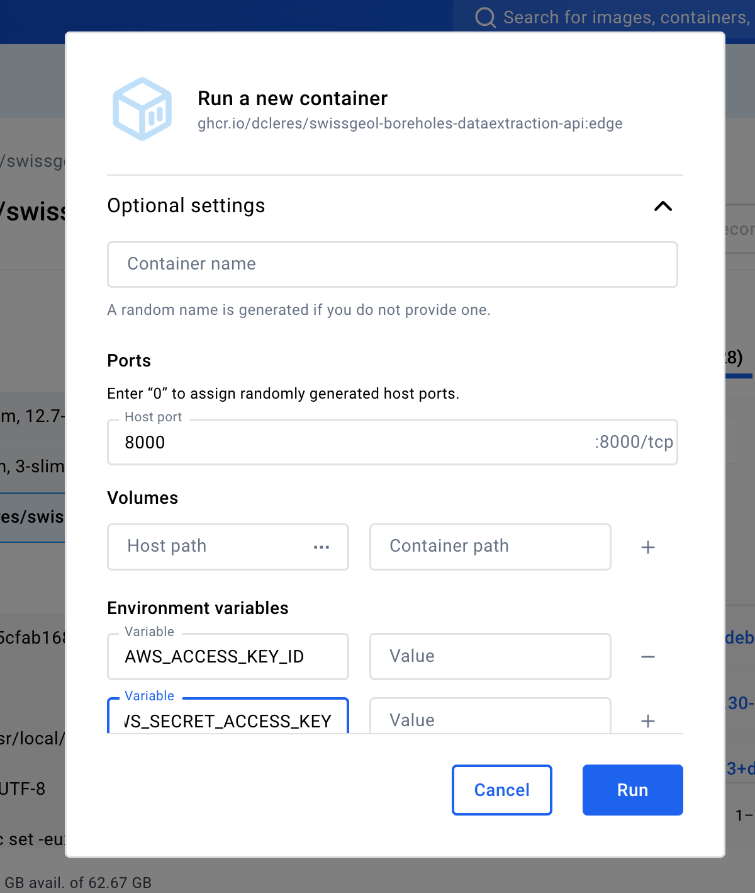
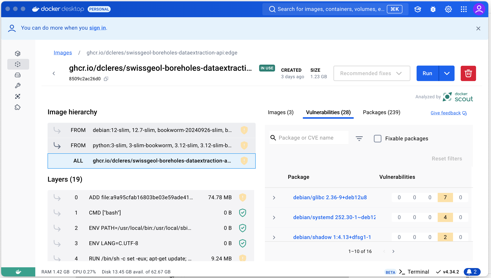

# API and Docker instructions
This README describes how to run the borehole data extraction API locally using FastAPI or Docker, including required AWS S3 configuration, environment variables, and instructions for building or pulling the Docker image.

## API

The API for this project is built using FastAPI, a modern, fast (high-performance), web framework for building APIs with Python.

To launch the API and access its endpoints, follow these steps:

1. **Activate the virtual environment**

Activate your virtual environment. On Unix systems, this can be done with the following command:

```bash
source env/bin/activate
```

<a name="env"></a>
2. **Environment variables**

Please make sure to define the environment variables needed for the API to access the S3 Bucket of interest.

- `AWS_ACCESS_KEY_ID`
- `AWS_SECRET_ACCESS_KEY`
- `AWS_ENDPOINT`, in the format `https://s3.<RegionName>.amazonaws.com`
  - During local development, a S3-compatible service like [MinIO](https://min.io/) can be used. In this case, the endpoint will look like `http://minio:9000`. 
- `AWS_S3_BUCKET`

The data extraction API in this repository is designed to be integrated into [swissgeol-boreholes-suite](https://github.com/swisstopo/swissgeol-boreholes-suite) that is configured by [swissgeol-boreholes-config](https://github.com/swisstopo/swissgeol-boreholes-config). You can find the AWS S3 bucket configuration used for that deployment in [charts/swissgeol-boreholes/values.yaml](https://github.com/swisstopo/swissgeol-boreholes-config/blob/ac293abe1c489044b3b15efa30c2238d456ded26/charts/swissgeol-boreholes/values.yaml#L65).

3. **Start the FastAPI server**

Run the following command to start the FastAPI server:

```bash
uvicorn src.app.main:app --reload --host 0.0.0.0 --port 8002
```

This will start the server on port 8002 of the localhost and enable automatic reloading whenever changes are made to the code. You can see the OpenAPI Specification (formerly Swagger Specification) by opening: `http://127.0.0.1:8002/docs#/` in your favorite browser. 

4. **Access the API endpoints**

Once the server is running, you can access the API endpoints using a web browser or an API testing tool like Postman.

The main endpoint for the data extraction pipeline is `http://localhost:8000/extract-data`. You can send a POST request to this endpoint with the PDF file you want to extract data from.

Additional endpoints and their functionalities can be found in the project's source code.

**Note:** Make sure to replace `localhost` with the appropriate hostname or IP address if you are running the server on a remote machine.

5. **Stop the server**

To stop the FastAPI server, press `Ctrl + C` in the terminal where the server is running. Please refer to the [FastAPI documentation](https://fastapi.tiangolo.com) for more information on how to work with FastAPI and build APIs using this framework.


## Build API as Local Docker Image

The borehole application offers a given amount of functionalities (extract text, number, and coordinates) through an API. To build this API using a Docker Container, you can run the following commands. 

1. **Navigate to the project directory**

Change your current directory to the project directory:

```bash
cd swissgeol-boreholes-dataextraction
```

2. **Build the Docker image**

Build the Docker image using the following command:

```bash
docker build -t borehole-api . -f Dockerfile
```

```bash
docker build --platform linux/amd64 -t borehole-api:test .
```

If docker is not setup yet, you might need to first use `docker login -u <username>` to login to your docker account.

This command will build the Docker image with the tag `borehole-api`.

3. **Verify the Docker image**

Verify that the Docker image has been successfully built by running the following command:

```bash
docker images
```

You should see the `borehole-api` image listed in the output.

4. **Run the Docker container**

4.1. **Run the Docker Container without worrying about AWS Credentials**

To run the Docker container, use the following command:

```bash
docker run -p 8000:8000 borehole-api
```

This command will start the container and map port 8000 of the container to port 8000 of the host machine.

4.2. **Run the docker image with the AWS credentials**

You should pass AWS credentials and S3 configuration as [environment variables](#env) when starting the Docker container.

**Using a `.env` file**

Adapt the `.env.template` file to your needs, by renaming the file to `.env` and adding your AWS credentials to the file.

The values from the `.env` file are automatically loaded into your Python environment thanks to the `python-dotenv` package.

To ensure that the values from the `.env` file are also passed along when starting a Docker container, you can use the `--env-file` argument, for example:

```bash
docker run --env-file .env -d -p 8000:8000 borehole-api
```

**Defining the environment variables in your shell**

For example, on Unix-based systems (Linux/macOS), add the following lines to your `~/.bashrc`, `~/.bash_profile`, or `~/.zshrc` (depending on your shell):

```bash
export AWS_ACCESS_KEY_ID=your_access_key_id
export AWS_SECRET_ACCESS_KEY=your_secret_access_key
export AWS_ENDPOINT=your_endpoint_url
export AWS_S3_BUCKET=your_bucket_name
```

After editing, run the following command to apply the changes:

```bash
source ~/.bashrc  # Or ~/.bash_profile, ~/.zshrc based on your configuration
```


5. **Access the API**

Once the container is running, you can access the API by opening a web browser and navigating to `http://localhost:8000`.

You can also use an API testing tool like Postman to send requests to the API endpoints.

**Note:** If you are running Docker on a remote machine, replace `localhost` with the appropriate hostname or IP address.


6. **Query the API**

```bash
curl -X 'POST' \
'http://localhost:8000/api/V1/create_pngs' \
-H 'accept: application/json' \
-H 'Content-Type: application/json' \
-d '{
"filename": "10021.pdf"
}'
```

7. **Stop the Docker container**

To stop the Docker container, press `Ctrl + C` in the terminal where the container is running.

Alternatively, you can use the following command to stop the container:

```bash
docker stop <container_id>
```

Replace `<container_id>` with the ID of the running container, which can be obtained by running `docker ps`.


## Use the Docker Image from the GitHub Container Registry
 
This repository provides a Docker image hosted in the GitHub Container Registry (GHCR) that can be used to run the application easily. Below are the steps to pull and run the Docker image.

1. **Pull the Docker Image from the GitHub Container Registry**
   
```bash
docker pull ghcr.io/swisstopo/swissgeol-boreholes-dataextraction-api:edge
```

**Run the docker image from the Terminal**
   
```bash
docker run -d --name swissgeol-boreholes-dataextraction-api -e AWS_ACCESS_KEY_ID=XXX -e AWS_SECRET_ACCESS_KEY=YYY -e AWS_ENDPOINT=ZZZ -e AWS_S3_BUCKET=AAA -p 8000:8000 ghcr.io/swisstopo/swissgeol-boreholes-dataextraction-api:TAG
```

Where XXX, YYY, ZZZ, AAA, and TAG are placeholder values that users should replace with their actual credentials and desired tag. 

Adjust the port mapping (8000:8000) based on the app's requirements.

NOTE: Do not forget to specify your AWS Credentials.

**Run the docker image from the Docker Desktop App**

Open the Docker Desktop app and navigate to `Images`, you should be able to see the image you just pulled from GHCR. Click on the image and click on the `Run` button on the top right of the screen. 

{ width=400px }

Then open the `Optional Settings` menu and specify the port and the AWS credentials

{ width=800px }


2.  **Verify the Container is Running**

To check if the container is running, use:

```bash
docker ps
```